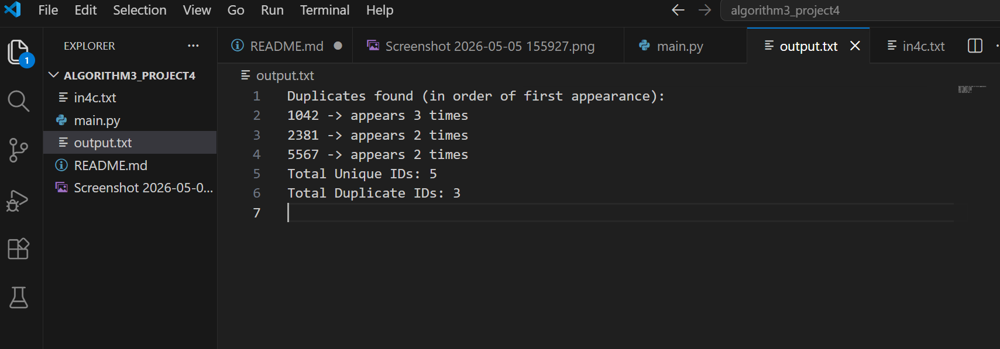
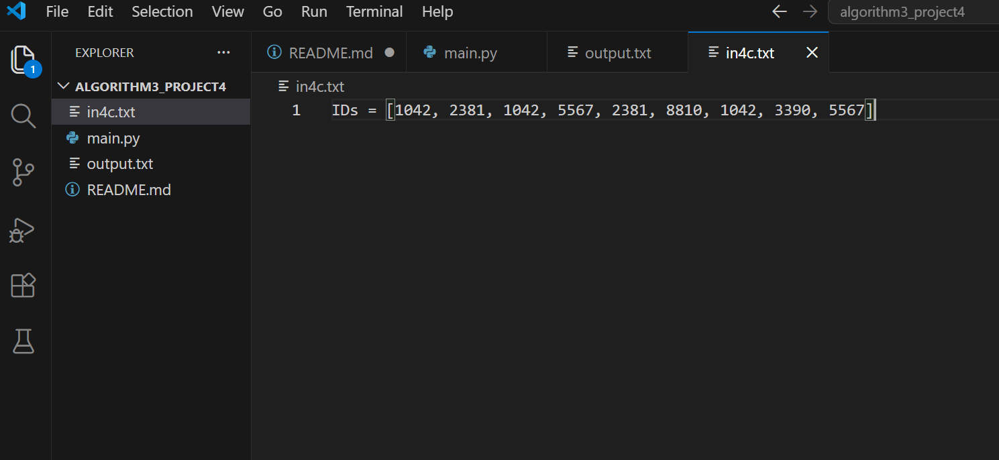
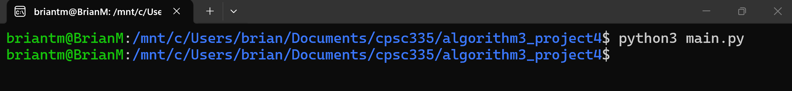

# Algorithm 3 Project 4

We will find ducplicates and let the user know how many duplicates of the students IDs we found.

## Tools

* Languages: Python
* Libraries: re

## Example of Algorithm 3

We read file in4c.txt:

  

Then we print duplicates in the order they appear, total unique IDs, and total duplicate IDs:

  

## Intructions to Run Program

Inside the project folder, type this command: python3 main.py
Here is an image of myself, performing this command:

  

Nice! You have found all duplicates and printed the correct output!